<div align="center">

# SeedOcean

**Open-source FFT ocean system for Three.js — WebGPU first, WebGL2 fallback.**

Persistent foam · 20 sea-state presets · buoyancy · underwater · spray & rain · TypeScript · `<water-canvas>`.

[](https://github.com/reed-soul/SeedOcean/actions/workflows/ci.yml)
[](https://reed-soul.github.io/SeedOcean/)
[](#)

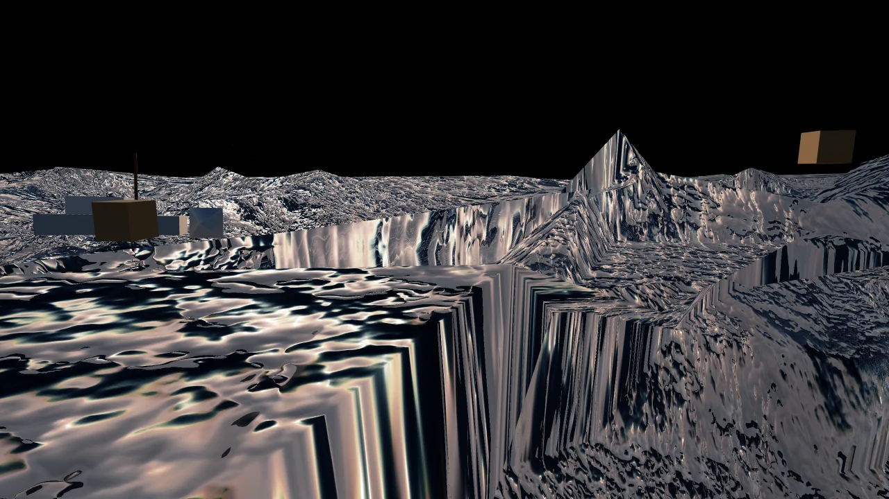

</div>

<table align="center">
  <tr>
    <td width="25%"><sub>Dawn Glass</sub><br>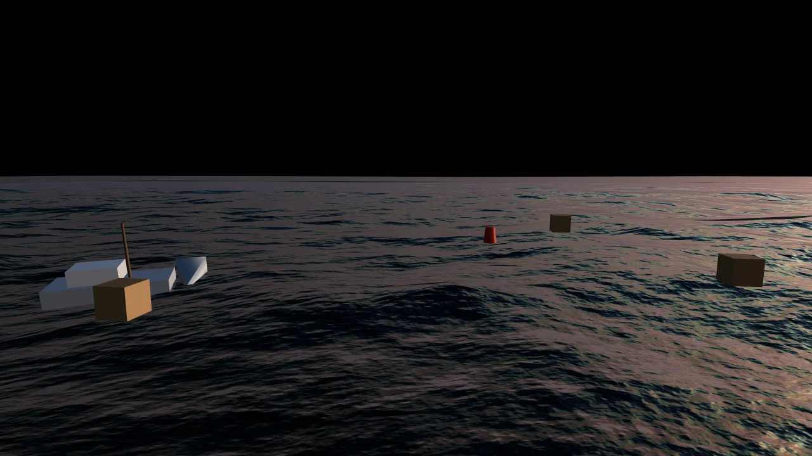</td>
    <td width="25%"><sub>Coastal Chop</sub><br>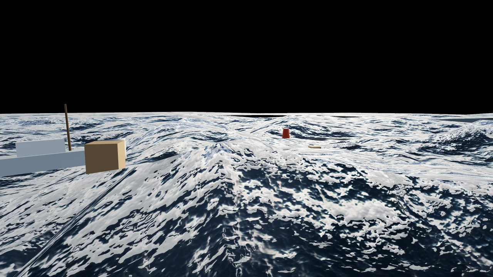</td>
    <td width="25%"><sub>Tropical Reef</sub><br>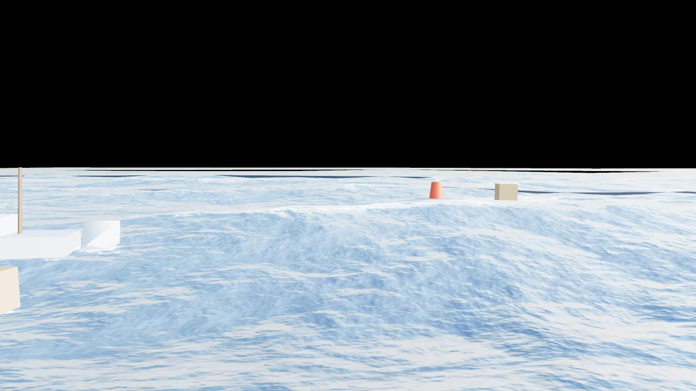</td>
    <td width="25%"><sub>Moonlit</sub><br>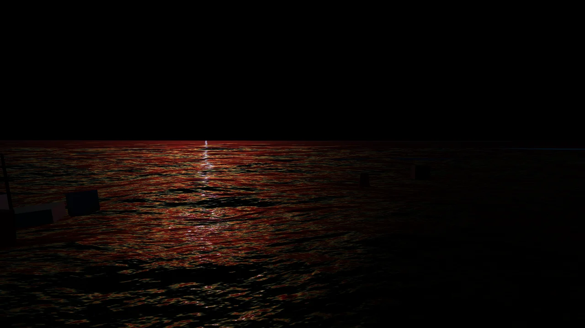</td>
  </tr>
  <tr>
    <td width="25%"><sub>Arctic</sub><br>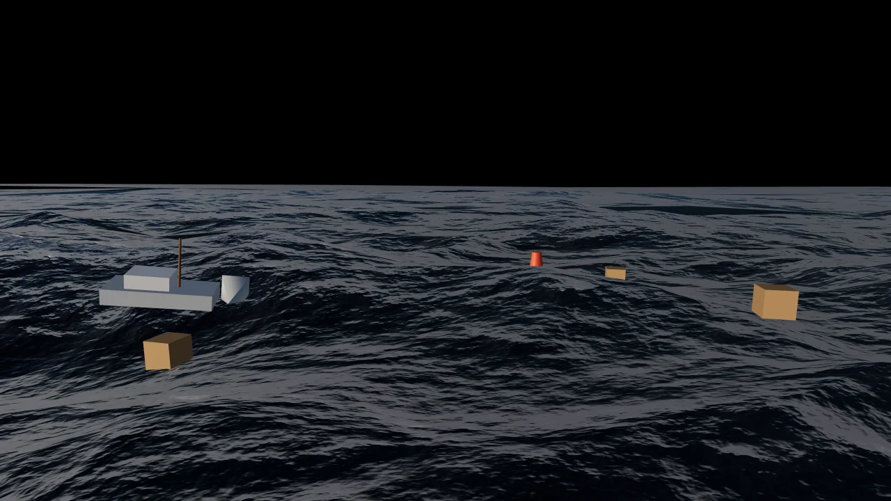</td>
    <td width="25%"><sub>Bioluminescent</sub><br>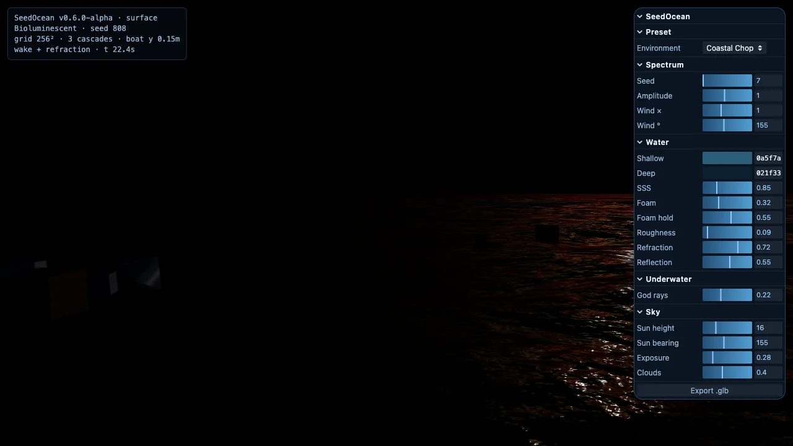</td>
    <td width="25%"><sub>Open Storm</sub><br>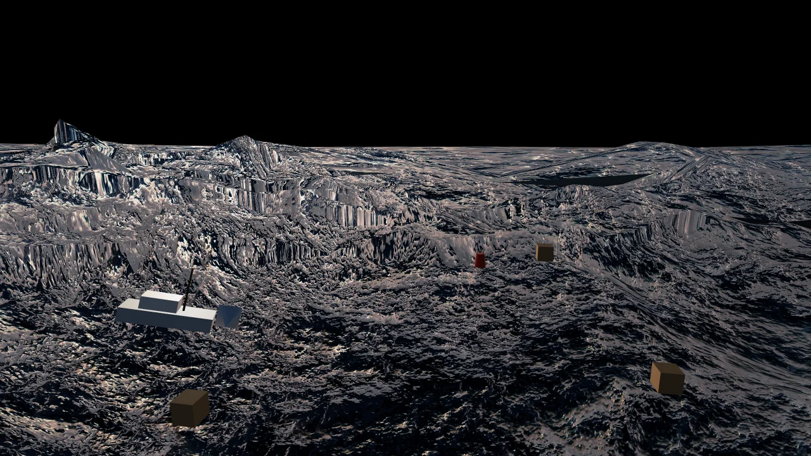</td>
    <td width="25%"><sub>Tempest</sub><br>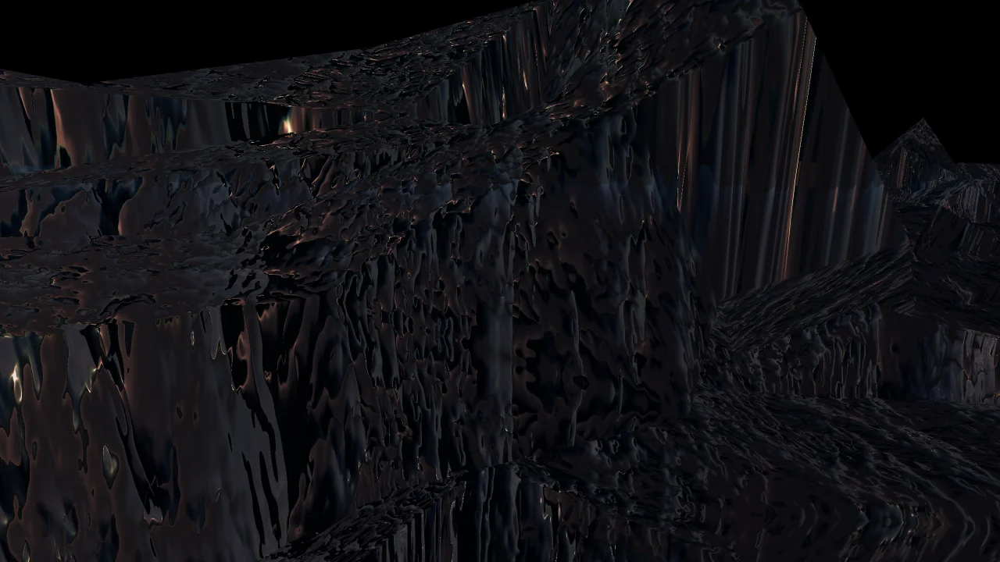</td>
  </tr>
  <tr>
    <td width="25%"><sub>Cartoon (cel)</sub><br>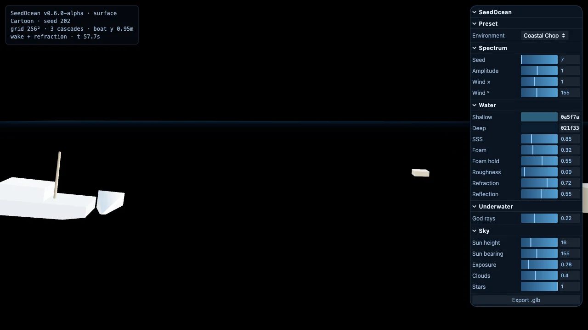</td>
    <td width="25%"><sub>Ink Wash</sub><br>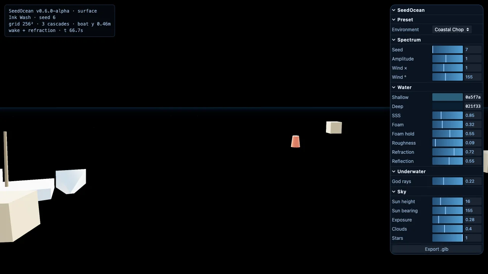</td>
    <td width="25%"><sub>Long Swell</sub><br>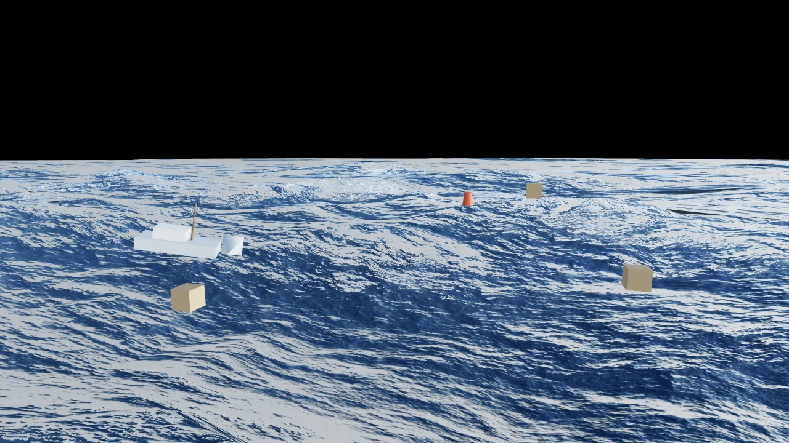</td>
    <td width="25%"><sub>Swimming Pool</sub><br>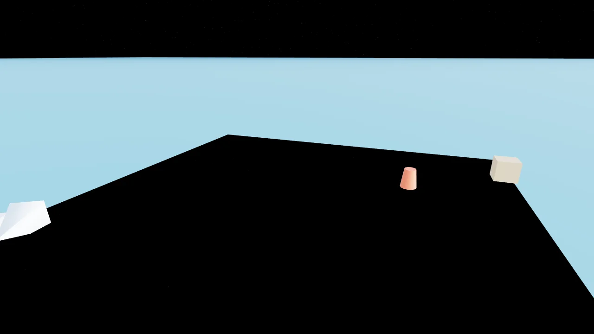</td>
  </tr>
  <tr>
    <td width="25%"><sub>Mountain Lake</sub><br>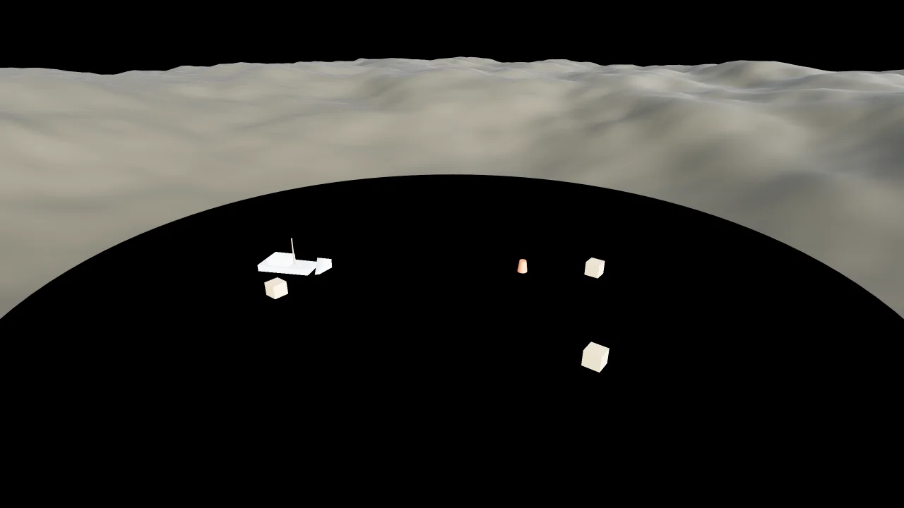</td>
    <td width="25%"><sub>River (flow)</sub><br>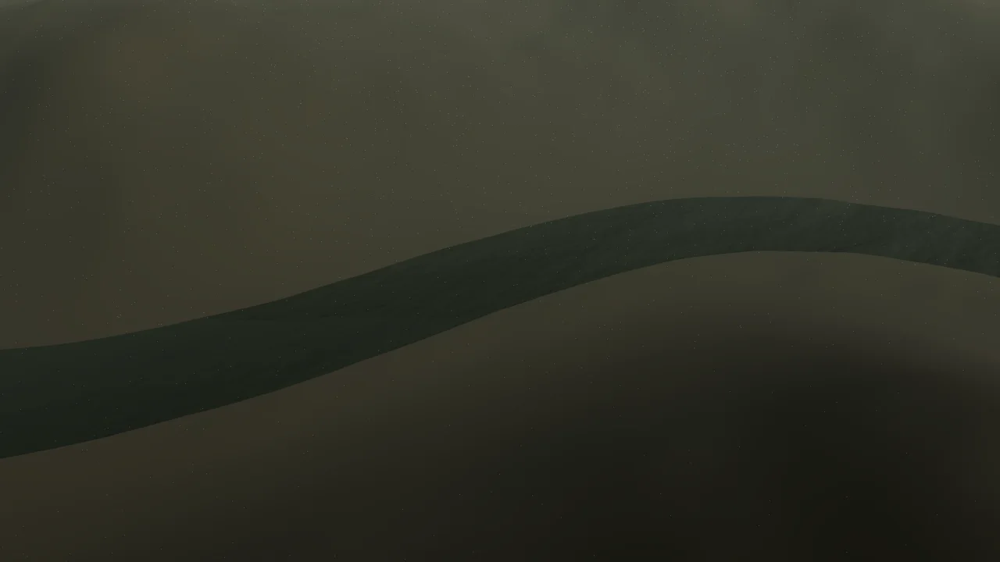</td>
    <td width="25%"><sub>Coastal Surf</sub><br><em>beach + white water</em></td>
    <td width="25%"></td>
  </tr>
</table>

> **Status: `v0.6.0-alpha`.** Twenty presets — realistic day/night/tropical/polar/bioluminescent, cel-shaded **Cartoon** and **Ink Wash** stylized modes, three bounded water types (tiled **Pool**, **Mountain Lake**, meandering **River**), and **Coastal Surf** (clipmap ocean meeting a sloping beach with depth-based white water). FFT ocean with persistent/advected foam, a 256² quality mode, TypeScript types, a `<water-canvas>` web component, atmospheric spray + rain, a headless Design API (`seedocean/api`), and a WebGL2/Gerstner fallback that keeps the API identical when WebGPU is unavailable.

## Live demo

**https://reed-soul.github.io/SeedOcean/**

Orbit below the surface for underwater mode. A boat leaves a wake; the red buoy and wooden crates float on the live wave field. Try **Bioluminescent** for glowing night crests, or **Tempest** for wind-blown spray and rain.

| Surface + wake | Underwater caustics |
|---|---|
| 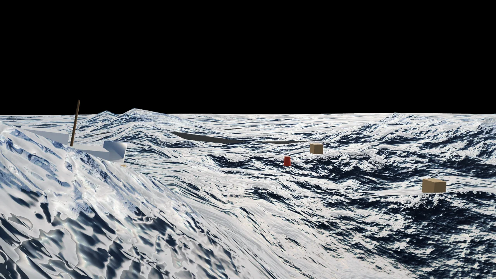 | 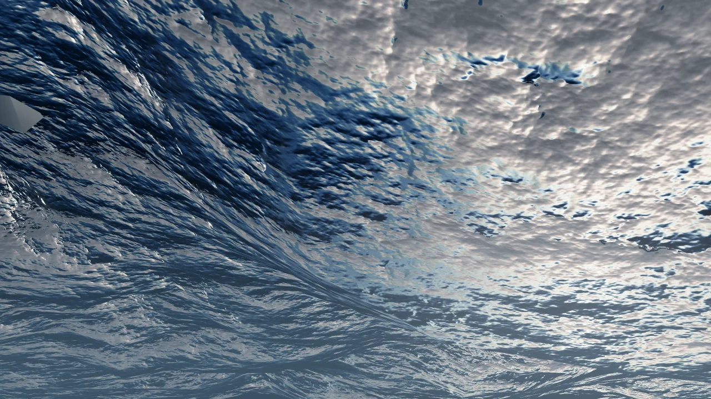 |


## Install

```bash
pnpm add seedocean three
```

Requires **WebGPU** (Chrome/Edge 113+).

## Quick start (library)

```javascript
import * as THREE from 'three/webgpu';
import { SeedOcean } from 'seedocean';

const renderer = new THREE.WebGPURenderer({ antialias: true });
renderer.setSize(window.innerWidth, window.innerHeight);
document.body.appendChild(renderer.domElement);
await renderer.init();

const scene = new THREE.Scene();
const camera = new THREE.PerspectiveCamera(55, innerWidth / innerHeight, 0.5, 6000);
camera.position.set(0, 14, 48);

const ocean = await SeedOcean.create({
  renderer,
  scene,
  camera,
  preset: 'coastal',   // any of the 20 presets
  quality: 'quality',  // 'perf' (128²) | 'quality' (256²)
});

function animate() {
  ocean.tick();
  requestAnimationFrame(animate);
}
animate();
```

Or drop in the web component — no bootstrap code needed:

```html
<script type="module">import 'seedocean/web-component.js';</script>
<water-canvas preset="coastal" quality="quality" demo></water-canvas>
```

### API

| Method | Description |
|--------|-------------|
| `SeedOcean.create(options)` | Build ocean + optional seafloor, underwater post, buoyancy |
| `ocean.update(dt?)` | Advance FFT, buoyancy, wake; returns `{ t, underwaterMix }` |
| `ocean.render()` | Render via underwater pipeline |
| `ocean.tick()` | `update()` + `render()` |
| `ocean.applyPreset(id)` | Switch calm / coastal / storm |
| `ocean.exportGLB()` | Bake current wave field to `.glb` |
| `ocean.dispose()` | Cleanup |

Options: `environment`, `seafloor`, `underwater`, `buoyancy`, `demoObjects`, `validateFFT`.

Re-exports: `PRESETS`, `buildFFTOcean`, `BuoyancySampler`, `validateFFT`, …

## What's in it

- **FFT / JONSWAP ocean** — GPU butterfly IFFT, 3 cascades (200 m / 20 m / 3.5 m), TMA shallow-water correction, dual wind-sea + swell bands
- **Persistent / advected foam** — ping-pong foam field, half-Lagrangian back-trace, live-tunable `foamPersistence`
- **Quality mode** — `quality: 'perf' | 'quality'` selects 128² vs 256² FFT grids
- **Infinite clipmap** — camera-snapped nested rings (~1.5 km)
- **Subsurface scattering** — sun-lit crest glow
- **Screen refraction / reflection** — viewport backdrop + planar reflector
- **Wake field** — boat stamps height + foam into a tiling CPU texture
- **Multi-body buoyancy** — spring-damper physics with pitch/roll
- **Underwater rendering** — depth tint, Snell's window, god rays
- **Shared caustics** — sea floor, buoy, boat hull, floating crates
- **Atmosphere** — wind-blown sea spray at breaking crests + a screen rain layer (zero-cost when intensity is 0)
- **WebGL2 fallback** — when WebGPU is unavailable, a Gerstner-wave renderer keeps the same API and visual identity
- **20 presets** — Calm Bay · Dawn Glass · Sea Mist · Light Breeze · Coastal Chop · **Coastal Surf** · Long Swell · **Tropical Reef** · Golden Sunset · **Moonlit** · **Arctic** · **Bioluminescent** · **Cartoon** · **Ink Wash** · **Pool** · **Mountain Lake** · **River** · Gale · Open Storm · Tempest
- **FlowMap** — spatially-varying flow + wet-shore foam (`seedocean-flowmap/1`) for lake/river/coast
- **Headless Design API** — `describe` / `design` / `toPreset` / `fromPreset` (no GPU)
- **TypeScript types** + **`<water-canvas>` web component** + **glTF export**

## Run locally

```bash
git clone https://github.com/reed-soul/SeedOcean.git
cd SeedOcean
pnpm install
pnpm dev      # http://localhost:5391
```

```bash
pnpm build          # production bundle
pnpm build:pages    # GitHub Pages (base /SeedOcean/)
pnpm test:fft       # GPU FFT self-test (needs Chromium + WebGPU)
pnpm test:api       # headless Design API + FlowMap self-test (Node, no GPU)
pnpm capture        # regenerate docs/assets screenshots + GIF
```

## Roadmap

| Phase | Target |
|-------|--------|
| 1 ✅ | Scaffold, presets, export |
| 2 ✅ | WebGPU FFT/IFFT (JONSWAP) |
| 3 ✅ | Clipmap, SSS, 3rd cascade |
| 4 ✅ | Underwater, caustics, buoyancy |
| 5 ✅ | Refraction/reflection, wake, multi-body physics |
| 6 ✅ | GitHub Pages, npm API, CI |
| 7 ✅ | v0.6/v0.7 — 19 presets + star field + cel mode + bounded pool water, quality mode, persistent foam, TS types, web component, spray/rain, WebGL2 fallback |
| 8 ✅ | fBm terrain subsystem (`buildTerrain`) + Mountain Lake preset |
| 9 ✅ | River preset: directional flow + Catmull-Rom ribbon + buoyancy current |
| 10 ✅ | Bounded-water scene enclosures (pool / lake valley / river gorge) + headless Design API |
| 11a/b ✅ | FlowMap contract (`seedocean-flowmap/1`) + runtime sampling (river tangents, wet-shore foam) |
| 11c ✅ | Coastal Surf — beach terrain + depth-based breaking foam + onshore rush |
| 11d 🔜 | Shoreline editor / flowmap painter (demo brush → preset export) |

## Layout

```
src/
  index.js            public API
  seedocean.js        SeedOcean.create() — WebGPU + WebGL2 dispatch
  seedocean.d.ts      TypeScript declarations
  web-component.js    <water-canvas> custom element
  api/                headless Design API (describe / design / toPreset)
  core/fft/           spectrum · IFFT · cascades · advected foam · surface material
  core/fallback/      gerstner-ocean.js — WebGL2 path
  core/flow-map.js    seedocean-flowmap/1 — shore foam + river tangents
  core/atmosphere.js  spray + rain
  core/wake-field.js  CPU wake texture
  core/caustics.js    shared underwater caustic pattern
  presets/            20 named sea states
```

## Docs

- [`docs/adding-a-preset.md`](docs/adding-a-preset.md) — contract for adding a sea state
- [`docs/sea-states.md`](docs/sea-states.md) — Signature / Basis / Carriers for every preset
- [`docs/ocean-fft-design.md`](docs/ocean-fft-design.md) — FFT / meshing / foam architecture
- [`src/api/README.md`](src/api/README.md) — headless Design API

## Reference

- Product pattern: [SkyeShark/SeedThree](https://github.com/SkyeShark/SeedThree)
- FFT ocean: [poseidon](https://github.com/owenyuwono/poseidon) (MIT)

## License

[MIT](LICENSE) © lushiqiang
